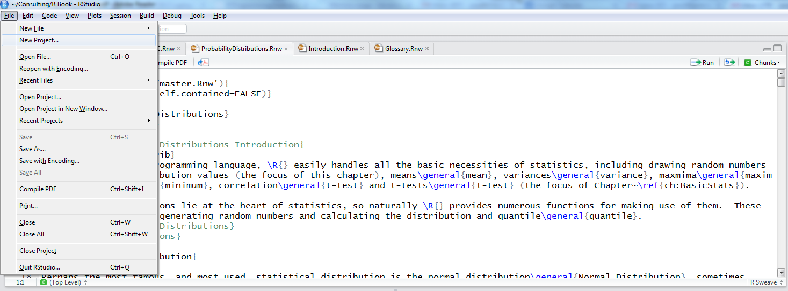

```{r knitr-options, echo = FALSE}
knitr::opts_chunk$set(
  collapse = TRUE,
  comment = "#>",
  fig.path = "README-"
)
```

```{css css-customization,echo=FALSE,include=FALSE}
code .sourceCode {
    white-space: pre-wrap;       /* Since CSS 2.1 */
    white-space: -moz-pre-wrap;  /* Mozilla, since 1999 */
    white-space: -pre-wrap;      /* Opera 4-6 */
    white-space: -o-pre-wrap;    /* Opera 7 */
    word-wrap: break-word;       /* Internet Explorer 5.5+ */
    overflow-wrap: break-word;
}
```

```{r settings,echo=FALSE, include=FALSE}
className <- params$className
organizer <- params$organizer
packages <- sort(params$packages)
```

# R Class

This is an empty repo to initialize an R project for `r className` at `r organizer`.

Please __follow all instructions__ to set up your environment for the training. Skimming the instructions often leads to errors, so be sure to read everything.

# Install R and RStudio

This is just like installing any other program.

- [R](https://cloud.r-project.org/)
- [RStudio](https://www.rstudio.com/products/rstudio/download/#download)

It is important to have the most recent version of R, which as of this repo creation was version `r params$r_version`.

# RStudio Project

I highly recommend using an [RStudio project](https://support.rstudio.com/hc/en-us/articles/200526207-Using-RStudio-Projects) (essentially just a folder on your computer to hold the files from class) to keep yourself organized.

You can either start your own project by clicking `File > New Project` or follow these instructions to copy the project for this class. You may need to create a [GitHub PAT](https://docs.github.com/en/authentication/keeping-your-account-and-data-secure/creating-a-personal-access-token) for this to work. Setting up your computer can be difficult, so if this does not work out for you contact the TA or me to get help. It's a one time process so don't get discouraged.

## Using the RStudio Gui to Copy this Project

This assumes you have `git` [installed](https://git-scm.com/book/en/v2/Getting-Started-Installing-Git).

Click `File > New Project`.

```{r new-project-click,echo=FALSE}

```

Click `Version Control`.

```{r version-control-click,echo=FALSE}
knitr::include_graphics('images/rstudio-create-project.png')
```

Click `Git`.

```{r git-click,echo=FALSE}
knitr::include_graphics('images/rstudio-create-project-version-control.png')
```

Choose a folder in the `Create project as a subdirectory of` field.

Paste ``r sprintf('https://github.com/%s/%s', params$repoOwner, params$repoName)``^[Or ``r sprintf('git@github.com:%s/%s.git', params$repoOwner, params$repoName)`` for ssh.] in the `Repository URL` field.

```{r paste-url,echo=FALSE}
knitr::include_graphics('images/rstudio-create-project-git.png')
```

# Install Packages

Once you have a project setup, you can install the add-on packages we will be using (and explaining) by running this code in the R console.

```{r install-packages,eval=FALSE}
install.packages(
    c(
        'here', 'knitr', 'rmarkdown', 'tidyverse', 'usethis', 'tidymodels', 
        'leaflet', 'leafgl', 'glmnet', 'xgboost', 'DiagrammeR', 'coefplot', 
        'flexdashboard', 'xaringan'
    )
)
```

# If it Still Does Not Work

If you are still having trouble setting up the project and getting everything installed you can sign up for an [RStudio.cloud](https://rstudio.cloud/) account.
